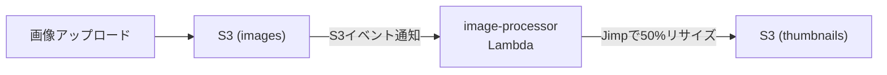

# はじめに
AWSやGoogle Cloudなどのパブリッククラウドを業務で利用している方の中には、環境構築にIaC（**Infrastructure as Code：コードによるインフラ管理**）を使って自動化している人もいると思います。

IaCは、**インフラストラクチャ（サーバー、ネットワーク、ストレージなど）の構成をコードで定義し、管理・運用する手法**です。

Web画面の管理コンソールから、手作業でリソースを構築する場合、**作業ミス**が起きやすく、構築する環境が複数あった場合に**同じ操作を何度も実施**する必要があり、作業コストが高くなったりします。

IaCを使えば、本番環境・ステージング環境・検証環境など、内容が類似する複数の環境を構築する場合に、ミスなく素早く構築できるだけではなく、環境を定義したコードをバージョン管理することで、バージョン間の環境差分を明確にすることができます。また、過去の環境に手軽にロールバックすることが可能になります。

クラウド環境にリソースを構築すると大抵は課金が発生するため、個人でIaCを試すのに躊躇する人もいるでしょう。そんな場合は、クラウド環境をローカルPC上に擬似的に再現できるツールを利用すれば、無課金でIaCを体験できます。

今回は、IaCのツールとして「**Terraform**」、AWSの擬似環境用のツールとして「**LocalStack**」を紹介します。

# 前提条件

本記事は、以下について概要レベルの知識を有している読者を想定しています。

- AWSサービスについての概要
- Dockerについての概要
- WSLについての概要

なお、ハンズオンで使用する環境は以下の通りです。

- Terraform v1.14.3
- LocalStack Community edition v3.0.2 (Dockerコンテナ)

# 解説
## LocalStack について
[LocalStack](https://www.localstack.cloud/) は、AWSやSnowflakeのクラウドサービスをローカル環境で模擬実行できるツールです。

本物のAWSサービスを構築するわけではないので、課金の心配なく利用可能です。

LocalStack は、主に以下のような用途で使われます。

- AWSサービスを呼び出すソフトウェアの単体テスト
- GitHub ActionsなどのCI/CDと連携させた自動統合テスト
- IaCを使ったAWS環境構築のテスト

### 料金プラン

LocalStack の料金プランには無料のCommunity版、有料のPro版があり、以下の違いがあります。

| **特徴** | **Community版** | **Pro版** |
| --- | --- | --- |
| **利用可能サービス数** | 一部主要サービスのみ | ほぼ全てのAWSサービス |
| **データ永続化** | 不可（LocalStack停止でリソース消失） | 可能 |
| **API/機能制限** | 一部APIや機能は利用不可 | すべてのAPI・機能が利用可能 |
| **公式サポート** | なし | あり |
| **追加機能** | なし | GUIや拡張機能など |

※Pro版の料金については、公式ページ参照。

### 利用できるAWSサービス

利用できる主なAWSサービス（のAPI）については以下の通りです。

| サービス | 概要 | Community版 | Pro版 | 備考 |
| --- | --- | --- | --- | --- |
| S3 | オブジェクトストレージサービス。ファイルや画像などを保存・配信 | ○ | ○ | すべての機能利用可能 |
| SNS | プッシュ通知・メッセージ配信サービス。Pub/Sub型のメッセージング | ○ | ○ | すべての機能利用可能 |
| SQS | メッセージキューサービス。非同期処理やシステム間連携に利用 | ○ | ○ | すべての機能利用可能 |
| Lambda | サーバーレスでコードを実行。イベント駆動型の関数実行環境 | ○ | ○ | すべての機能利用可能 |
| API Gateway | REST/WebSocket APIの作成・管理。Lambdaとの連携が容易 | △ | ○ | 一部APIはPro限定 |
| DynamoDB | フルマネージドNoSQLデータベース。高速でスケーラブル | ○ | ○ | すべての機能利用可能 |
| ElastiCache | インメモリキャッシュサービス。Redis/Memcached互換 | × | ○ | Pro限定 |
| Cognito | ユーザー認証・認可サービス。サインアップ/サインイン機能を提供 | × | ○ | Pro限定 |
| RDS | リレーショナルデータベースサービス。MySQL/PostgreSQL等に対応 | × | ○ | Pro限定 |
| ECS | コンテナオーケストレーションサービス。Dockerコンテナを管理 | × | ○ | Pro限定 |
| EC2 | 仮想サーバーサービス。任意のOSやアプリケーションを実行可能 | △ | ○ | Community版はAPIモッキングのみ。実際のインスタンス起動・SSH接続等はPro版が必要 |

※凡例：「△」は一部機能のみ、「×」は利用不可、「○」は利用可能

### 注意点

- VPCやサブネット、セキュリティグループ、ネットワークACLなどのリソースは作成できますが、**本物の通信制御（パケットレベルのフィルタリングや分離）は再現されません**。設定値は登録されますが、期待通りの通信制約は動作しないので、VPCなどのネットワークの疎通確認はできません。
- LocalStackの内部では、AWSリソースを簡略化した処理・保存・取得・削除などの操作が行われています。基本的には同様の動きをするように作られていますが、細かい権限制御やエラーハンドリングなどは完全一致していません。

## Terraform について
Terraform は、HashiCorp社が開発したオープンソースのIaCツールで、AWSやGoogle Cloudなどマルチクラウドのリソース構築に対応しています。

### その他のIaCツールとの比較

その他のIaCツールとの比較は以下の通りです。

| 特徴 | Terraform | CloudFormation | Ansible |
| --- | --- | --- | --- |
| 提供元 | HashiCorp | AWS | Red Hat（コミュニティ主体） |
| 主な用途 | インフラ構築（IaC） | AWS専用のインフラ構築（IaC） | 構成管理・設定変更 |
| 対応クラウド | マルチクラウド（AWS, Azure, GCP等） | AWSのみ（基本的に） | マルチクラウド（SSH接続ベース） |
| 記述形式 | HashiCorp Configuration Language | JSON または YAML | YAML（Playbook） |
| エージェント | 不要 | 不要 | 不要（SSHで操作） |
| 状態管理 | 自動（.tfstateファイルで管理） | 自動（スタックで管理） | 明示的な状態管理なし |
| 構成の再利用性 | 高（モジュール機能あり） | 中（スタックテンプレート） | 高（ロールやテンプレート） |
| ドライラン（Dry run） | `plan` で可 | `ChangeSet` で可 | `--check` で可 |
| 学習コスト | 中 | 中〜高（AWS知識が必要） | 低〜中（YAMLの習得） |
| 他ツールとの連携 | 高（豊富なプロバイダ） | 低〜中（基本はAWS連携） | 高（多くのモジュールあり） |
| 運用対象 | インフラ構築向け | AWSリソース構築向け | サーバー設定・ミドルウェア設定向け |

Terraformと他のIaCツール（CloudFormation、Ansible、Crossplaneなど）との**最大の違い**は、**マルチクラウド対応と宣言的な状態管理（stateファイル）による差分適用の仕組み**にあります。

- **マルチクラウド対応**
    TerraformはAWS、Azure、GCPなど**複数のクラウドサービスやオンプレミス環境を単一の言語（HCL）で横断的に管理できる**のが最大の特徴です。他の多くのIaCツール（CloudFormationはAWS専用、BicepはAzure専用など）は特定クラウドに特化しています。


- **宣言的な状態管理と差分適用**
    Terraformは`.tfstate`ファイルでインフラの現状を管理し、コードと実際のリソースの差分を自動で検出・適用します。
    これにより、インフラの「あるべき姿」を宣言し、変更があれば自動で最適な順序で適用・削除できます。


- **依存関係の自動判定**
    リソース間の依存関係を自動で解析し、作成・削除の順序を最適化します。手動で順序を指定する必要がなく、大規模環境でも自動化が容易です。
    例えば、EC2インスタンスを作る前に、VPC→サブネット→セキュリティグループ→EC2の順のように、サービス構築の前後関係があった場合、Terraformが順番に作成していきます。

### その他のIaCとの棲み分け

| シナリオ例 | 推奨ツール |
| --- | --- |
| AWS上のサーバー・ネットワーク構築 | CloudFormation |
| AWS + GCP + Azureの統合管理 | Terraform |
| EC2へのNginxインストールや設定変更 | Ansible |
| IaCと構成管理を両立したい | Terraform + Ansible の併用 |

### Terraformのアーキテクチャ
大きく分けて、以下の３つの構成で形成されます。


1. **Terraform Core**
    - ユーザーがTerraformを操作する際の主要インターフェース
    - ユーザーは、構成ファイル（.tf）を編集してTerraformに読み込ませ、terraformのコマンドを用いてリソースのプロビジョニングを行う
2. **Providers**
    - Terraformがさまざまなサービス（クラウドプロバイダー、データベース、DNSサービスなど）と通信するためのプラグインモジュール
    - 各プロバイダーは、Terraformが管理できるリソースを定義し、そのリソースに対するTerraformの設定を、各サービス特有のAPIコールに変換する役割を持つ
3. **State file**
    - JSON形式で記録され、Terraformが管理するリソースやその依存関係・現在の状態が格納される
    - Terraformはこのファイルを参照して、設定変更時に必要な変更点を特定し、リソースの不要な再作成を防ぐ
    - ローカルやリモート（Azure Storage、Amazon S3、HashiCorp Consulなど）に保存でき、**インフラ情報や機密情報が含まれるため厳重な管理とバックアップが必要**とされている

### Terraform 開発の流れ

Terraformの開発は以下の流れで行います。

#### terraform init：初期化
  - 使用するプロバイダー（例：AWS）のプラグインをダウンロード
  - `.terraform/` ディレクトリを作成
  - `terraform.lock.hcl` を生成（依存バージョン固定）

#### *.tf ファイルの作成・編集
  - 実際のリソースやプロバイダーの定義を書く
  - 設計として「どのクラウドに、どんな構成を作るか」をコードに落とし込む

例（AWS EC2を作成する場合）:

```
provider "aws" {
  region     = "ap-northeast-1"
  access_key = "dummy"
  secret_key = "dummy"
}

resource "aws_instance" "example" {
  ami           = "ami-12345678"
  instance_type = "t2.micro"
}
```

#### terraform plan：実行前の差分確認
  - 編集した定義ファイル（.tf）と、現在のリソース状態（.tfstate）を比較
  - **何が追加・変更・削除されるか** を事前に確認

新規リソースが定義ファイルに追加されていた差分例：

```
# aws_s3_bucket.new_bucket will be created
+ resource "aws_s3_bucket" "new_bucket" {
    + acl                         = "private"
    + bucket                      = "my-new-bucket-202507"
    + force_destroy               = false
    + id                          = (known after apply)
    + tags                        = {
        + "Environment" = "dev"
      }
  }

Plan: 1 to add, 0 to change, 0 to destroy.
```

既存リソースが定義ファイルで変更されていた差分例：

```
# aws_instance.web will be updated in-place
~ resource "aws_instance" "web" {
      id                           = "i-0abcd1234efgh5678"
    ~ instance_type                = "t2.micro" -> "t3.micro"
      ami                          = "ami-0abc123456789def0"
      availability_zone            = "ap-northeast-1a"
      ...
  }

Plan: 0 to add, 1 to change, 0 to destroy.
```

既存リソースが定義ファイルで削除されていた差分例：

```
# aws_security_group.unused_sg will be destroyed
- resource "aws_security_group" "unused_sg" {
      id          = "sg-0abc123456789def0"
      name        = "old-security-group"
      description = "no longer needed"
      vpc_id      = "vpc-0123abcd4567efgh"
  }

Plan: 0 to add, 0 to change, 1 to destroy.
```

※差分が出た際のアクション

| 出力 | 何を意味するか | どう対応すべきか |
| --- | --- | --- |
| `+` Add | リソースが新しく追加される | 正常。追加して問題なければOK |
| `~` Change | リソースに変更がある | 設定変更の意図と一致しているか確認 |
| `-` Destroy | リソースが削除される | 想定外の削除がないか要チェック |

<details>
<summary>tfファイルとtfstateファイルの違い</summary>

| 項目 | tfファイル | tfstateファイル |
| --- | --- | --- |
| **役割** | インフラストラクチャの定義を記述 | インフラストラクチャの現在の状態をスナップショット（記録） |
| **形式** | HCL（HashiCorp Configuration Language） | JSON |
| **内容** | リソースの作成・変更・削除の指示 | 実際に作成されたリソースの詳細情報 |
| **可読性** | 人間が読み書き可能 | Terraform内部で使用されるデータファイル |
| **保存場所** | プロジェクトディレクトリ内で管理 | ローカル、またはS3・GCSなどのリモートバックエンド |
</details>

<details>
<summary>tfファイルの構成について</summary>

Terraformでは、役割に応じてファイルを分割することで、可読性と保守性を向上させます。

- ルートモジュール（プロジェクト直下）

| ファイル名 | 役割 | 説明 |
| --- | --- | --- |
| `main.tf` | メイン定義 | リソースの定義やモジュールの呼び出しを記述する。プロジェクトの中心となるファイル。 |
| `outputs.tf` | 出力定義 | `terraform apply` 後に表示する値や、他のモジュールから参照される値を定義する。 |
| `providers.tf` | プロバイダー設定 | AWS、GCP、Azureなどのプロバイダーの設定やバージョン制約を記述する。 |
| `variables.tf` | 変数定義 | 外部から注入する変数（環境ごとの設定値など）を定義する。デフォルト値や型、説明を含む。 |

- モジュール（modules/サービス名/）

| ファイル名 | 役割 | 説明 |
| --- | --- | --- |
| `main.tf` | リソース定義 | モジュール内で管理するリソース（EC2、RDS、S3など）を定義する。 |
| `outputs.tf` | 出力定義 | モジュールの呼び出し元に返す値を定義する（例：作成したリソースのID、ARNなど）。 |
| `variables.tf` | 入力変数定義 | モジュールが受け取る引数を定義する。モジュールの再利用性を高めるために使用。 |

- ディレクトリ構成例

```
project/
├── main.tf           # モジュール呼び出し、リソース定義
├── outputs.tf        # プロジェクト全体の出力
├── providers.tf      # プロバイダー設定
├── variables.tf      # プロジェクト全体の変数
├── terraform.tfvars  # 変数の値を設定（オプション）
└── modules/
    ├── vpc/
    │   ├── main.tf
    │   ├── outputs.tf
    │   └── variables.tf
    ├── ec2/
    │   ├── main.tf
    │   ├── outputs.tf
    │   └── variables.tf
    └── rds/
        ├── main.tf
        ├── outputs.tf
        └── variables.tf
```
</details>

<details>
<summary>tfファイルの依存関係について</summary>
- 依存関係の概要図

```
┌─────────────────────────────────────────────────────────────────────┐
│                        ルートモジュール                              │
├─────────────────────────────────────────────────────────────────────┤
│                                                                     │
│   ┌──────────────┐                                                  │
│   │ providers.tf │  ← 最初に読み込まれる（プロバイダー設定）          │
│   └──────┬───────┘                                                  │
│          │ 依存                                                     │
│          ▼                                                          │
│   ┌──────────────┐      ┌──────────────┐                           │
│   │ variables.tf │ ───► │   main.tf    │                           │
│   └──────────────┘      └──────┬───────┘                           │
│          │                     │                                    │
│          │    ┌────────────────┘                                    │
│          │    │ モジュール呼び出し                                   │
│          ▼    ▼                                                     │
│   ┌──────────────┐                                                  │
│   │  outputs.tf  │  ← リソース作成後に値を出力                       │
│   └──────────────┘                                                  │
│                                                                     │
└─────────────────────────────────────────────────────────────────────┘
          │
          │ module "xxx" { source = "./modules/xxx" }
          ▼
┌─────────────────────────────────────────────────────────────────────┐
│                    子モジュール (modules/xxx/)                       │
├─────────────────────────────────────────────────────────────────────┤
│                                                                     │
│   ┌──────────────┐      ┌──────────────┐      ┌──────────────┐     │
│   │ variables.tf │ ───► │   main.tf    │ ───► │  outputs.tf  │     │
│   │  (入力受取)  │      │ (リソース定義)│      │  (値を返却)  │     │
│   └──────────────┘      └──────────────┘      └──────────────┘     │
│                                                                     │
└─────────────────────────────────────────────────────────────────────┘
```

- ファイル別の依存関係

| ファイル | 参照されるファイル | 参照するファイル |
| --- | --- | --- |
| `providers.tf` | `main.tf`（暗黙的） | なし |
| `variables.tf` | `main.tf`, `outputs.tf` | なし |
| `main.tf` | `outputs.tf` | `providers.tf`, `variables.tf`, 子モジュール |
| `outputs.tf` | 親モジュール | `main.tf`のリソース, `variables.tf` |

- 処理フロー

```
1. terraform init
   └─► providers.tf を読み込み、プロバイダープラグインをダウンロード

2. terraform plan / apply
   ├─► variables.tf から変数定義を読み込み
   ├─► terraform.tfvars から変数値を読み込み（存在する場合）
   ├─► main.tf を処理
   │   ├─► リソースを定義
   │   └─► モジュールを呼び出し
   │       └─► modules/xxx/variables.tf  入力を受け取る
   │       └─► modules/xxx/main.tf       リソースを作成
   │       └─► modules/xxx/outputs.tf    値を返却
   └─► outputs.tf を処理し、結果を出力
```

</details>

#### terraform apply：反映（リソース作成・更新）
- planで確認した変更を実際にクラウドに反映する
  - 初回は `terraform.tfstate` が作成される
  - 2回目以降は `tfstate` をもとに差分が適用される
  - `terraform.tfstate.backup` も作られる（安全のため）
  - クラウドへのリソース反映が成功した後、`tfstate`が更新される

#### terraform destroy：リソース削除（必要に応じて）
- Terraformで作ったリソースを一括で削除
- `tfstate` に記録された情報をもとに削除する

## ハンズオン
S3バケットにアップロードされた画像ファイルをLambdaでリサイズして、別のS3バケットに配置する画像処理パイプラインを、TerraformでLocalStack上に作成します。



### プロジェクトの構成

```
  tufn-202508/
  ├── terraform/
  │   └── 03-image-pipeline/
  │       ├── main.tf              # S3バケット、イベント通知、モジュール呼び出し
  │       ├── variables.tf         # 変数定義
  │       ├── providers.tf         # LocalStackプロバイダ設定
  │       ├── outputs.tf           # 出力値（バケット名、Lambda ARN等）
  │       ├── apply.sh             # 構築スクリプト
  │       ├── destroy.sh           # 破棄スクリプト
  │       └── modules/
  │           └── lambda/          # Lambda関数とIAM管理
  │               ├── main.tf      # image-processor Lambda定義
  │               ├── variables.tf
  │               └── outputs.tf
  │
  └── lambda-functions/
      └── 03-image-pipeline/
          └── image-processor/     # Node.js版画像処理
              ├── index.js         # Jimpで50%リサイズ処理
              ├── package.json     # Jimp, aws-sdk 依存関係
              └── package-lock.json
```

### 主要コンポーネント

| コンポーネント            | 役割                                     |
|---------------------------|------------------------------------------|
| sample-app-dev-images     | 画像アップロード先バケット               |
| sample-app-dev-thumbnails | サムネイル保存先バケット                 |
| image-processor Lambda    | Jimpで画像を50%リサイズ                |
| S3イベント通知            | imagesバケットへのアップロードをトリガー |

### LocalStackの起動

docker compose でLocalStackのコンテナを起動します。

```yaml:docker-compose.yml
services:
  localstack:
    image: localstack/localstack:3.0
    container_name: localstack
    ports:
      - "4566:4566"
      - "4510-4559:4510-4559"
    environment:
      - SERVICES=s3,dynamodb,lambda,apigateway,events,cloudwatch,iam,sts,logs,secretsmanager,ssm,ec2,ses
      - DEBUG=0
      - DATA_DIR=/var/lib/localstack/data
      - DOCKER_HOST=unix:///var/run/docker.sock
      - LAMBDA_EXECUTOR=docker
    volumes:
      - ./localstack:/etc/localstack/init/ready.d
      - /var/run/docker.sock:/var/run/docker.sock
      - localstack_data:/var/lib/localstack
    networks:
      - cicd-network

volumes:
  localstack_data:

networks:
  cicd-network:
    driver: bridge
```

```bash
$ docker compose up -d
WARN[0000] Found orphan containers ([tufn-202508-terraform-1]) for this project. If you removed or renamed this service in your compose file, you can run this command with the --remove-orphans flag to clean it up. 
[+] Running 2/2
 ✔ Network tufn-202508_cicd-network  Created                                                                                 0.0s 
 ✔ Container localstack              Started 
```

[LocalStack](https://app.localstack.cloud/)で無料のCommunity版アカウントを登録しておくと、ローカルPC上のDockerコンテナに作成したリソースの一覧をWeb UI上で確認できます。


### TerraformでAWSリソース構築

<details>
<summary>Lambda Functionを事前に用意</summary>

S3バケットにアップロードされた画像ファイルをリサイズするLambda Functionのソースコードを用意します。

```javascript:lambda-functions/03-image-pipeline/image-processor/index.js
/**
 * ============================================================================
 * Image Processor Lambda関数
 * ============================================================================
 *
 * 概要:
 *   S3バケットにアップロードされた画像を自動的にリサイズし、
 *   サムネイルを別のS3バケットに保存するイベント駆動型の画像処理関数。
 *
 * トリガー:
 *   - S3イベント通知（ObjectCreated）
 *     imagesバケットに画像がアップロードされると自動実行
 *
 * 処理フロー:
 *   1. S3イベントから画像情報（バケット名、キー）を取得
 *   2. 元画像をS3からダウンロード
 *   3. Jimpライブラリで画像を50%サイズにリサイズ
 *   4. リサイズ後の画像をサムネイルバケットにアップロード
 *
 * 使用ライブラリ:
 *   - Jimp: Pure JavaScript画像処理ライブラリ（バイナリ依存なし）
 *     ※ PillowはLocalStack環境で動作しないため、Jimpを採用
 *
 * S3バケット:
 *   - 入力: serverless-demo-local-images（環境変数で変更可能）
 *   - 出力: serverless-demo-local-thumbnails（THUMBNAIL_BUCKET環境変数）
 *
 * 環境変数:
 *   - THUMBNAIL_BUCKET: サムネイル出力先バケット名
 *   - LOCALSTACK_HOSTNAME: LocalStackホスト名
 *
 * メタデータ:
 *   生成されるサムネイルには以下のメタデータが付与される:
 *   - original-bucket: 元画像のバケット名
 *   - original-key: 元画像のキー
 *   - original-size: 元画像のサイズ（例: 800x600）
 *   - thumbnail-size: サムネイルのサイズ（例: 400x300）
 *
 * ============================================================================
 */

const AWS = require('aws-sdk');
const Jimp = require('jimp');

/**
 * S3クライアントの初期化
 * LocalStack環境ではパススタイルURLと専用エンドポイントを使用
 */
const s3 = new AWS.S3({
    endpoint: process.env.LOCALSTACK_HOSTNAME
        ? `http://${process.env.LOCALSTACK_HOSTNAME}:4566`
        : 'http://localhost:4566',
    s3ForcePathStyle: true,  // LocalStackではパススタイルが必須
    region: 'us-east-1',
    accessKeyId: 'test',
    secretAccessKey: 'test'
});

/**
 * Lambda関数のメインハンドラー
 *
 * @param {Object} event - S3イベント通知オブジェクト
 * @param {Array} event.Records - S3イベントレコードの配列
 * @returns {Object} 処理結果（処理件数など）
 */
exports.handler = async (event) => {
    console.log('Image processor triggered:', JSON.stringify(event, null, 2));

    const thumbnailBucket = process.env.THUMBNAIL_BUCKET || 'localstack-demo-dev-thumbnails';
    let processedCount = 0;

    // 各S3イベントレコードを処理
    for (const record of event.Records) {
        const bucket = record.s3.bucket.name;
        // S3キーのURLデコード（スペースや特殊文字対応）
        const key = decodeURIComponent(record.s3.object.key.replace(/\+/g, ' '));

        console.log(`Processing image: ${bucket}/${key}`);

        try {
            // --------------------------------------------------------
            // Step 1: S3から元画像をダウンロード
            // --------------------------------------------------------
            const getResult = await s3.getObject({
                Bucket: bucket,
                Key: key
            }).promise();

            console.log(`Downloaded image, size: ${getResult.Body.length} bytes`);

            // --------------------------------------------------------
            // Step 2: Jimpで画像を読み込み・リサイズ
            // --------------------------------------------------------
            const image = await Jimp.read(getResult.Body);
            const originalWidth = image.getWidth();
            const originalHeight = image.getHeight();

            // 元画像の50%サイズに縮小
            const newWidth = Math.floor(originalWidth / 2);
            const newHeight = Math.floor(originalHeight / 2);

            image.resize(newWidth, newHeight);
            image.quality(85);  // JPEG品質を85%に設定

            console.log(`Resized from ${originalWidth}x${originalHeight} to ${newWidth}x${newHeight}`);

            // --------------------------------------------------------
            // Step 3: サムネイルをバッファに変換
            // --------------------------------------------------------
            const thumbnailBuffer = await image.getBufferAsync(Jimp.MIME_JPEG);

            // --------------------------------------------------------
            // Step 4: サムネイルをS3にアップロード
            // --------------------------------------------------------
            await s3.putObject({
                Bucket: thumbnailBucket,
                Key: key,  // 元のキーと同じ名前で保存
                Body: thumbnailBuffer,
                ContentType: 'image/jpeg',
                Metadata: {
                    'original-bucket': bucket,
                    'original-key': key,
                    'original-size': `${originalWidth}x${originalHeight}`,
                    'thumbnail-size': `${newWidth}x${newHeight}`
                }
            }).promise();

            console.log(`Uploaded thumbnail to ${thumbnailBucket}/${key}`);
            processedCount++;

        } catch (error) {
            console.error(`Error processing ${key}:`, error);
            throw error;  // エラーを再スローして失敗を通知
        }
    }

    return {
        statusCode: 200,
        body: {
            message: 'Image processing completed',
            processedCount: processedCount
        }
    };
};
```

画像リサイズに必要なライブラリをインストールします。

```json:lambda-functions/03-image-pipeline/image-processor/package.json
{
  "name": "image-processor",
  "version": "1.0.0",
  "description": "S3 triggered image processor using Jimp",
  "main": "index.js",
  "scripts": {
    "test": "echo \"Error: no test specified\" && exit 1"
  },
  "keywords": [],
  "author": "",
  "license": "ISC",
  "type": "commonjs",
  "dependencies": {
    "aws-sdk": "^2.1693.0",
    "jimp": "^0.22.12"
  }
}
```

LocalStackにデプロイするために、ZIPファイルにします。

```bash
$ cd lambda-functions/03-image-pipeline/image-processor
$ npm install --production
$ zip -r image-processor.zip index.js package.json node_modules/
```
</details>

<details>
<summary>初期化</summary>

```bash
$ cd terraform/03-image-pipeline
$ terraform init
```

</details>

<details>
<summary>tfファイル作成</summary>

```hcl:providers.tf
# 画像処理パイプライン - プロバイダー設定

terraform {
  required_version = ">= 1.0.0"

  required_providers {
    aws = {
      source  = "hashicorp/aws"
      version = "~> 5.0"
    }
  }
}

# LocalStack用AWSプロバイダー設定
provider "aws" {
  access_key                  = "test"
  secret_key                  = "test"
  region                      = "us-east-1"
  skip_credentials_validation = true
  skip_metadata_api_check     = true
  skip_requesting_account_id  = true
  s3_use_path_style           = true

  endpoints {
    iam    = "http://localhost:4566"
    lambda = "http://localhost:4566"
    logs   = "http://localhost:4566"
    s3     = "http://localhost:4566"
    sts    = "http://localhost:4566"
  }
}
```

```hcl:variables.tf
# 画像処理パイプライン - 変数定義

variable "project_name" {
  description = "Project name"
  type        = string
  default     = "localstack-demo"
}

variable "environment" {
  description = "Environment name"
  type        = string
  default     = "dev"
}
```

```hcl:main.tf
# 画像処理パイプライン
# S3イベント駆動のサムネイル生成

# S3バケットを先に作成（Lambda権限のsource_arnで必要）
resource "aws_s3_bucket" "images" {
  bucket = "${var.project_name}-${var.environment}-images"
}

resource "aws_s3_bucket" "thumbnails" {
  bucket = "${var.project_name}-${var.environment}-thumbnails"
}

# Lambdaモジュール
module "lambda" {
  source = "./modules/lambda"

  project_name           = var.project_name
  environment            = var.environment
  images_bucket_arn      = aws_s3_bucket.images.arn
  thumbnails_bucket_name = aws_s3_bucket.thumbnails.bucket
  thumbnails_bucket_arn  = aws_s3_bucket.thumbnails.arn
}

# S3イベント通知
resource "aws_s3_bucket_notification" "images_notification" {
  bucket = aws_s3_bucket.images.id

  lambda_function {
    lambda_function_arn = module.lambda.function_arn
    events              = ["s3:ObjectCreated:*"]
    filter_suffix       = ".jpg"
  }

  lambda_function {
    lambda_function_arn = module.lambda.function_arn
    events              = ["s3:ObjectCreated:*"]
    filter_suffix       = ".jpeg"
  }

  lambda_function {
    lambda_function_arn = module.lambda.function_arn
    events              = ["s3:ObjectCreated:*"]
    filter_suffix       = ".png"
  }

  depends_on = [module.lambda]
}
```

```hcl:outputs.tf
# 画像処理パイプライン - 出力定義

output "function_name" {
  description = "Lambda function name"
  value       = module.lambda.function_name
}

output "images_bucket" {
  description = "Images bucket name (upload here)"
  value       = aws_s3_bucket.images.bucket
}

output "thumbnails_bucket" {
  description = "Thumbnails bucket name (output here)"
  value       = aws_s3_bucket.thumbnails.bucket
}

# テスト用コマンド
output "test_upload_command" {
  description = "Command to upload test image"
  value       = "aws --endpoint-url=http://localhost:4566 s3 cp test.jpg s3://${aws_s3_bucket.images.bucket}/test.jpg"
}

output "check_thumbnail_command" {
  description = "Command to check thumbnail"
  value       = "aws --endpoint-url=http://localhost:4566 s3 ls s3://${aws_s3_bucket.thumbnails.bucket}/"
}
```

```hcl:modules/lambda/variables.tf
variable "project_name" {
  description = "Project name"
  type        = string
}

variable "environment" {
  description = "Environment name"
  type        = string
}

variable "images_bucket_arn" {
  description = "Images bucket ARN"
  type        = string
}

variable "thumbnails_bucket_name" {
  description = "Thumbnails bucket name"
  type        = string
}

variable "thumbnails_bucket_arn" {
  description = "Thumbnails bucket ARN"
  type        = string
}
```

```hcl:modules/lambda/main.tf
# Lambda関数モジュール - 画像処理パイプライン用

# Lambda用のIAMロール
resource "aws_iam_role" "lambda_role" {
  name = "${var.project_name}-${var.environment}-image-processor-role"

  assume_role_policy = jsonencode({
    Version = "2012-10-17"
    Statement = [
      {
        Action = "sts:AssumeRole"
        Effect = "Allow"
        Principal = {
          Service = "lambda.amazonaws.com"
        }
      }
    ]
  })
}

# Lambda用のIAMポリシー
resource "aws_iam_role_policy" "lambda_policy" {
  role = aws_iam_role.lambda_role.id

  policy = jsonencode({
    Version = "2012-10-17"
    Statement = [
      {
        Effect = "Allow"
        Action = [
          "logs:CreateLogGroup",
          "logs:CreateLogStream",
          "logs:PutLogEvents"
        ]
        Resource = "arn:aws:logs:*:*:*"
      },
      {
        Effect = "Allow"
        Action = [
          "s3:GetObject",
          "s3:GetObjectAcl"
        ]
        Resource = "${var.images_bucket_arn}/*"
      },
      {
        Effect = "Allow"
        Action = [
          "s3:PutObject",
          "s3:PutObjectAcl"
        ]
        Resource = "${var.thumbnails_bucket_arn}/*"
      }
    ]
  })
}

# Image Processor Lambda関数
resource "aws_lambda_function" "image_processor" {
  filename         = "${path.module}/../../../../lambda-functions/03-image-pipeline/image-processor/image-processor.zip"
  function_name    = "${var.project_name}-${var.environment}-image-processor"
  role             = aws_iam_role.lambda_role.arn
  handler          = "index.handler"
  runtime          = "nodejs18.x"
  timeout          = 60
  memory_size      = 256

  environment {
    variables = {
      THUMBNAIL_BUCKET = var.thumbnails_bucket_name
      ENVIRONMENT      = var.environment
    }
  }
}

# S3からLambdaを呼び出す権限
resource "aws_lambda_permission" "s3_invoke" {
  statement_id  = "AllowS3Invoke"
  action        = "lambda:InvokeFunction"
  function_name = aws_lambda_function.image_processor.function_name
  principal     = "s3.amazonaws.com"
  source_arn    = var.images_bucket_arn
}
```

```hcl:modules/lambda/outputs.tf
output "function_name" {
  description = "Lambda function name"
  value       = aws_lambda_function.image_processor.function_name
}

output "function_arn" {
  description = "Lambda function ARN"
  value       = aws_lambda_function.image_processor.arn
}

output "permission_id" {
  description = "Lambda permission ID"
  value       = aws_lambda_permission.s3_invoke.id
}
```
</details>

<details>
<summary>terraform plan実施</summary>
terraform planで、新規に作成されるリソースを確認します。

```bash
$ terraform plan

Terraform used the selected providers to generate the following execution plan. Resource actions are indicated with the following
symbols:
  + create

Terraform will perform the following actions:

  # aws_s3_bucket.images will be created
  + resource "aws_s3_bucket" "images" {
      + acceleration_status         = (known after apply)
      + acl                         = (known after apply)
      + arn                         = (known after apply)
      + bucket                      = "localstack-demo-dev-images"
      + bucket_domain_name          = (known after apply)
      + bucket_prefix               = (known after apply)
      + bucket_regional_domain_name = (known after apply)
      + force_destroy               = false
      + hosted_zone_id              = (known after apply)
      + id                          = (known after apply)
      + object_lock_enabled         = (known after apply)
      + policy                      = (known after apply)
      + region                      = (known after apply)
      + request_payer               = (known after apply)
      + tags_all                    = (known after apply)
      + website_domain              = (known after apply)
      + website_endpoint            = (known after apply)

      + cors_rule (known after apply)

      + grant (known after apply)

      + lifecycle_rule (known after apply)

      + logging (known after apply)

      + object_lock_configuration (known after apply)

      + replication_configuration (known after apply)

      + server_side_encryption_configuration (known after apply)

      + versioning (known after apply)

      + website (known after apply)
    }

  # aws_s3_bucket.thumbnails will be created
  + resource "aws_s3_bucket" "thumbnails" {
      + acceleration_status         = (known after apply)
      + acl                         = (known after apply)
      + arn                         = (known after apply)
      + bucket                      = "localstack-demo-dev-thumbnails"
      + bucket_domain_name          = (known after apply)
      + bucket_prefix               = (known after apply)
      + bucket_regional_domain_name = (known after apply)
      + force_destroy               = false
      + hosted_zone_id              = (known after apply)
      + id                          = (known after apply)
      + object_lock_enabled         = (known after apply)
      + policy                      = (known after apply)
      + region                      = (known after apply)
      + request_payer               = (known after apply)
      + tags_all                    = (known after apply)
      + website_domain              = (known after apply)
      + website_endpoint            = (known after apply)

      + cors_rule (known after apply)

      + grant (known after apply)

      + lifecycle_rule (known after apply)

      + logging (known after apply)

      + object_lock_configuration (known after apply)

      + replication_configuration (known after apply)

      + server_side_encryption_configuration (known after apply)

      + versioning (known after apply)

      + website (known after apply)
    }

  # aws_s3_bucket_notification.images_notification will be created
  + resource "aws_s3_bucket_notification" "images_notification" {
      + bucket      = (known after apply)
      + eventbridge = false
      + id          = (known after apply)

      + lambda_function {
          + events              = [
              + "s3:ObjectCreated:*",
            ]
          + filter_suffix       = ".jpg"
          + id                  = (known after apply)
          + lambda_function_arn = (known after apply)
        }
      + lambda_function {
          + events              = [
              + "s3:ObjectCreated:*",
            ]
          + filter_suffix       = ".jpeg"
          + id                  = (known after apply)
          + lambda_function_arn = (known after apply)
        }
      + lambda_function {
          + events              = [
              + "s3:ObjectCreated:*",
            ]
          + filter_suffix       = ".png"
          + id                  = (known after apply)
          + lambda_function_arn = (known after apply)
        }
    }

  # module.lambda.aws_iam_role.lambda_role will be created
  + resource "aws_iam_role" "lambda_role" {
      + arn                   = (known after apply)
      + assume_role_policy    = jsonencode(
            {
              + Statement = [
                  + {
                      + Action    = "sts:AssumeRole"
                      + Effect    = "Allow"
                      + Principal = {
                          + Service = "lambda.amazonaws.com"
                        }
                    },
                ]
              + Version   = "2012-10-17"
            }
        )
      + create_date           = (known after apply)
      + force_detach_policies = false
      + id                    = (known after apply)
      + managed_policy_arns   = (known after apply)
      + max_session_duration  = 3600
      + name                  = "localstack-demo-dev-image-processor-role"
      + name_prefix           = (known after apply)
      + path                  = "/"
      + tags_all              = (known after apply)
      + unique_id             = (known after apply)

      + inline_policy (known after apply)
    }

  # module.lambda.aws_iam_role_policy.lambda_policy will be created
  + resource "aws_iam_role_policy" "lambda_policy" {
      + id          = (known after apply)
      + name        = (known after apply)
      + name_prefix = (known after apply)
      + policy      = (known after apply)
      + role        = (known after apply)
    }

  # module.lambda.aws_lambda_function.image_processor will be created
  + resource "aws_lambda_function" "image_processor" {
      + architectures                  = (known after apply)
      + arn                            = (known after apply)
      + code_sha256                    = (known after apply)
      + filename                       = "modules/lambda/../../../../lambda-functions/03-image-pipeline/image-processor/image-processor.zip"
      + function_name                  = "localstack-demo-dev-image-processor"
      + handler                        = "index.handler"
      + id                             = (known after apply)
      + invoke_arn                     = (known after apply)
      + last_modified                  = (known after apply)
      + memory_size                    = 256
      + package_type                   = "Zip"
      + publish                        = false
      + qualified_arn                  = (known after apply)
      + qualified_invoke_arn           = (known after apply)
      + reserved_concurrent_executions = -1
      + role                           = (known after apply)
      + runtime                        = "nodejs18.x"
      + signing_job_arn                = (known after apply)
      + signing_profile_version_arn    = (known after apply)
      + skip_destroy                   = false
      + source_code_hash               = (known after apply)
      + source_code_size               = (known after apply)
      + tags_all                       = (known after apply)
      + timeout                        = 60
      + version                        = (known after apply)

      + environment {
          + variables = {
              + "ENVIRONMENT"      = "dev"
              + "THUMBNAIL_BUCKET" = "localstack-demo-dev-thumbnails"
            }
        }

      + ephemeral_storage (known after apply)

      + logging_config (known after apply)

      + tracing_config (known after apply)
    }

  # module.lambda.aws_lambda_permission.s3_invoke will be created
  + resource "aws_lambda_permission" "s3_invoke" {
      + action              = "lambda:InvokeFunction"
      + function_name       = "localstack-demo-dev-image-processor"
      + id                  = (known after apply)
      + principal           = "s3.amazonaws.com"
      + source_arn          = (known after apply)
      + statement_id        = "AllowS3Invoke"
      + statement_id_prefix = (known after apply)
    }

Plan: 7 to add, 0 to change, 0 to destroy.

Changes to Outputs:
  + check_thumbnail_command = "aws --endpoint-url=http://localhost:4566 s3 ls s3://localstack-demo-dev-thumbnails/"
  + function_name           = "localstack-demo-dev-image-processor"
  + images_bucket           = "localstack-demo-dev-images"
  + test_upload_command     = "aws --endpoint-url=http://localhost:4566 s3 cp test.jpg s3://localstack-demo-dev-images/test.jpg"
  + thumbnails_bucket       = "localstack-demo-dev-thumbnails"
```
</details>

<details>
<summary>terraform apply実施</summary>
terraform applyで、リソースを作成します。途中、実行確認プロンプトが出るので「yes」を入力します。

```bash
$ terraform apply

Terraform used the selected providers to generate the following execution plan. Resource actions are indicated with the following
symbols:
  + create

Terraform will perform the following actions:

  # aws_s3_bucket.images will be created
  + resource "aws_s3_bucket" "images" {
      + acceleration_status         = (known after apply)
      + acl                         = (known after apply)
      + arn                         = (known after apply)
      + bucket                      = "localstack-demo-dev-images"
      + bucket_domain_name          = (known after apply)
      + bucket_prefix               = (known after apply)
      + bucket_regional_domain_name = (known after apply)
      + force_destroy               = false
      + hosted_zone_id              = (known after apply)
      + id                          = (known after apply)
      + object_lock_enabled         = (known after apply)
      + policy                      = (known after apply)
      + region                      = (known after apply)
      + request_payer               = (known after apply)
      + tags_all                    = (known after apply)
      + website_domain              = (known after apply)
      + website_endpoint            = (known after apply)

      + cors_rule (known after apply)

      + grant (known after apply)

      + lifecycle_rule (known after apply)

      + logging (known after apply)

      + object_lock_configuration (known after apply)

      + replication_configuration (known after apply)

      + server_side_encryption_configuration (known after apply)

      + versioning (known after apply)

      + website (known after apply)
    }

  # aws_s3_bucket.thumbnails will be created
  + resource "aws_s3_bucket" "thumbnails" {
      + acceleration_status         = (known after apply)
      + acl                         = (known after apply)
      + arn                         = (known after apply)
      + bucket                      = "localstack-demo-dev-thumbnails"
      + bucket_domain_name          = (known after apply)
      + bucket_prefix               = (known after apply)
      + bucket_regional_domain_name = (known after apply)
      + force_destroy               = false
      + hosted_zone_id              = (known after apply)
      + id                          = (known after apply)
      + object_lock_enabled         = (known after apply)
      + policy                      = (known after apply)
      + region                      = (known after apply)
      + request_payer               = (known after apply)
      + tags_all                    = (known after apply)
      + website_domain              = (known after apply)
      + website_endpoint            = (known after apply)

      + cors_rule (known after apply)

      + grant (known after apply)

      + lifecycle_rule (known after apply)

      + logging (known after apply)

      + object_lock_configuration (known after apply)

      + replication_configuration (known after apply)

      + server_side_encryption_configuration (known after apply)

      + versioning (known after apply)

      + website (known after apply)
    }

  # aws_s3_bucket_notification.images_notification will be created
  + resource "aws_s3_bucket_notification" "images_notification" {
      + bucket      = (known after apply)
      + eventbridge = false
      + id          = (known after apply)

      + lambda_function {
          + events              = [
              + "s3:ObjectCreated:*",
            ]
          + filter_suffix       = ".jpg"
          + id                  = (known after apply)
          + lambda_function_arn = (known after apply)
        }
      + lambda_function {
          + events              = [
              + "s3:ObjectCreated:*",
            ]
          + filter_suffix       = ".jpeg"
          + id                  = (known after apply)
          + lambda_function_arn = (known after apply)
        }
      + lambda_function {
          + events              = [
              + "s3:ObjectCreated:*",
            ]
          + filter_suffix       = ".png"
          + id                  = (known after apply)
          + lambda_function_arn = (known after apply)
        }
    }

  # module.lambda.aws_iam_role.lambda_role will be created
  + resource "aws_iam_role" "lambda_role" {
      + arn                   = (known after apply)
      + assume_role_policy    = jsonencode(
            {
              + Statement = [
                  + {
                      + Action    = "sts:AssumeRole"
                      + Effect    = "Allow"
                      + Principal = {
                          + Service = "lambda.amazonaws.com"
                        }
                    },
                ]
              + Version   = "2012-10-17"
            }
        )
      + create_date           = (known after apply)
      + force_detach_policies = false
      + id                    = (known after apply)
      + managed_policy_arns   = (known after apply)
      + max_session_duration  = 3600
      + name                  = "localstack-demo-dev-image-processor-role"
      + name_prefix           = (known after apply)
      + path                  = "/"
      + tags_all              = (known after apply)
      + unique_id             = (known after apply)

      + inline_policy (known after apply)
    }

  # module.lambda.aws_iam_role_policy.lambda_policy will be created
  + resource "aws_iam_role_policy" "lambda_policy" {
      + id          = (known after apply)
      + name        = (known after apply)
      + name_prefix = (known after apply)
      + policy      = (known after apply)
      + role        = (known after apply)
    }

  # module.lambda.aws_lambda_function.image_processor will be created
  + resource "aws_lambda_function" "image_processor" {
      + architectures                  = (known after apply)
      + arn                            = (known after apply)
      + code_sha256                    = (known after apply)
      + filename                       = "modules/lambda/../../../../lambda-functions/03-image-pipeline/image-processor/image-processor.zip"
      + function_name                  = "localstack-demo-dev-image-processor"
      + handler                        = "index.handler"
      + id                             = (known after apply)
      + invoke_arn                     = (known after apply)
      + last_modified                  = (known after apply)
      + memory_size                    = 256
      + package_type                   = "Zip"
      + publish                        = false
      + qualified_arn                  = (known after apply)
      + qualified_invoke_arn           = (known after apply)
      + reserved_concurrent_executions = -1
      + role                           = (known after apply)
      + runtime                        = "nodejs18.x"
      + signing_job_arn                = (known after apply)
      + signing_profile_version_arn    = (known after apply)
      + skip_destroy                   = false
      + source_code_hash               = (known after apply)
      + source_code_size               = (known after apply)
      + tags_all                       = (known after apply)
      + timeout                        = 60
      + version                        = (known after apply)

      + environment {
          + variables = {
              + "ENVIRONMENT"      = "dev"
              + "THUMBNAIL_BUCKET" = "localstack-demo-dev-thumbnails"
            }
        }

      + ephemeral_storage (known after apply)

      + logging_config (known after apply)

      + tracing_config (known after apply)
    }

  # module.lambda.aws_lambda_permission.s3_invoke will be created
  + resource "aws_lambda_permission" "s3_invoke" {
      + action              = "lambda:InvokeFunction"
      + function_name       = "localstack-demo-dev-image-processor"
      + id                  = (known after apply)
      + principal           = "s3.amazonaws.com"
      + source_arn          = (known after apply)
      + statement_id        = "AllowS3Invoke"
      + statement_id_prefix = (known after apply)
    }

Plan: 7 to add, 0 to change, 0 to destroy.

Changes to Outputs:
  + check_thumbnail_command = "aws --endpoint-url=http://localhost:4566 s3 ls s3://localstack-demo-dev-thumbnails/"
  + function_name           = "localstack-demo-dev-image-processor"
  + images_bucket           = "localstack-demo-dev-images"
  + test_upload_command     = "aws --endpoint-url=http://localhost:4566 s3 cp test.jpg s3://localstack-demo-dev-images/test.jpg"
  + thumbnails_bucket       = "localstack-demo-dev-thumbnails"

Do you want to perform these actions?
  Terraform will perform the actions described above.
  Only 'yes' will be accepted to approve.

  Enter a value: yes

aws_s3_bucket.thumbnails: Creating...
aws_s3_bucket.images: Creating...
aws_s3_bucket.thumbnails: Creation complete after 0s [id=localstack-demo-dev-thumbnails]
aws_s3_bucket.images: Creation complete after 0s [id=localstack-demo-dev-images]
module.lambda.aws_iam_role_policy.lambda_policy: Creating...
module.lambda.aws_lambda_function.image_processor: Creating...
module.lambda.aws_iam_role_policy.lambda_policy: Creation complete after 0s [id=localstack-demo-dev-image-processor-role:terraform-20260102121953254100000001]
module.lambda.aws_lambda_function.image_processor: Creation complete after 8s [id=localstack-demo-dev-image-processor]
module.lambda.aws_lambda_permission.s3_invoke: Creating...
module.lambda.aws_lambda_permission.s3_invoke: Creation complete after 0s [id=AllowS3Invoke]
aws_s3_bucket_notification.images_notification: Creating...
aws_s3_bucket_notification.images_notification: Creation complete after 0s [id=localstack-demo-dev-images]

Apply complete! Resources: 6 added, 0 changed, 0 destroyed.

Outputs:

check_thumbnail_command = "aws --endpoint-url=http://localhost:4566 s3 ls s3://localstack-demo-dev-thumbnails/"
function_name = "localstack-demo-dev-image-processor"
images_bucket = "localstack-demo-dev-images"
test_upload_command = "aws --endpoint-url=http://localhost:4566 s3 cp test.jpg s3://localstack-demo-dev-images/test.jpg"
thumbnails_bucket = "localstack-demo-dev-thumbnails"
```
</details>

<details>
<summary>作成されたリソースの確認</summary>
Web UIで、作成されたS3バケット、Lambdaを確認します。


未だS3バケットに画像ファイルはアップロードされていません。


Lambdaはデプロイされています。


</details>

### 画像ファイルをアップロード検証

S3バケットに画像ファイルを配置して、リサイズされることを確認します。
先にサンプル画像を用意します。

```bash
$ ls -la /tmp/test.jpg 
-rw-r--r-- 1 ubuntu ubuntu 225986 Jan  2 21:36 /tmp/test.jpg
```

aws s3コマンドを使ってS3バケットにファイルをアップロードします。

```bash
$ aws --endpoint-url=http://localhost:4566 --region us-east-1 s3 cp \
  /tmp/test.jpg s3://localstack-demo-dev-images/test.jpg
upload: ../../../../tmp/test.jpg to s3://localstack-demo-dev-images/test.jpg
```

LocalStackのWEB UIで確認します。


画像がリサイズされて別のS3バケットに出力されました。


S3バケットから画像ファイルをダウンロードして確認しましょう。

```bash
$ aws --endpoint-url=http://localhost:4566 --region us-east-1 s3 cp \
  s3://localstack-demo-dev-thumbnails/test.jpg /tmp/thumbnail_test.jpg
download: s3://localstack-demo-dev-thumbnails/test.jpg to ../../../../tmp/thumbnail_test.jpg

$ ls -la /tmp/thumbnail_test.jpg
-rw-r--r-- 1 ryota ryota 50116 Jan  2 21:42 /tmp/thumbnail_test.jpg
```

# まとめ

本記事では、LocalStackとTerraformを使って、無課金でAWSリソースのIaC体験を行いました。

- **LocalStack**を使えば、AWSの主要サービス（S3、Lambda、DynamoDBなど）をローカル環境で擬似的に再現でき、課金を気にせずに開発・テストが可能
- **Terraform**は、マルチクラウド対応の宣言的IaCツールで、`.tfstate`ファイルによる状態管理と差分適用により、効率的なインフラ管理ができる
- ハンズオンでは、**S3イベント駆動のLambda画像処理パイプライン**をTerraformで構築し、実際に画像のリサイズ処理が動作することを確認

LocalStackとTerraformの組み合わせは、以下のような場面で活用できます。

- IaCの学習・練習
- CI/CDパイプラインでの自動テスト
- 本番デプロイ前の動作検証

ぜひ本記事を参考に、無課金でIaCを体験してみてください。

一緒にIaCやCI/CDについて学んでいきたいなど、ご興味を持たれた方は、[弊社ホームページ](https://www.tech-ult.com/contact-8)からお問い合わせいただければ幸いです。

# 参考

- [LocalStack 公式サイト](https://www.localstack.cloud/)
- [LocalStack ドキュメント](https://docs.localstack.cloud/overview/)
- [LocalStack GitHub](https://github.com/localstack/localstack)
- [Terraform 公式サイト](https://www.terraform.io/)
- [Terraform ドキュメント](https://developer.hashicorp.com/terraform/docs)
- [Terraform AWS Provider ドキュメント](https://registry.terraform.io/providers/hashicorp/aws/latest/docs)
- [LocalStack + Terraform 連携ガイド](https://docs.localstack.cloud/user-guide/integrations/terraform/)
